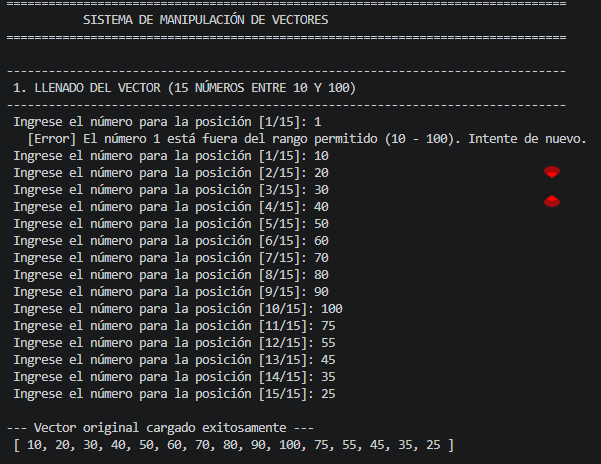
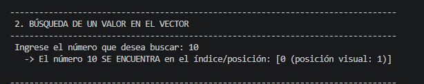
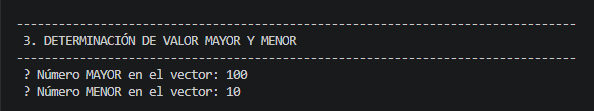
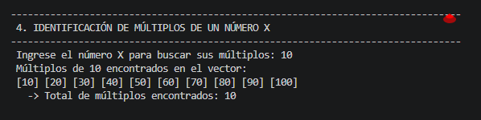
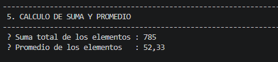
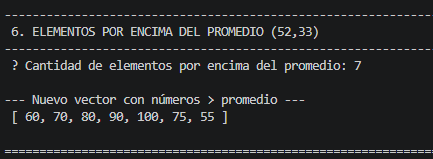

# Manipulacion de Vectores en Java

## Objetivo del Proyecto

Desarrollar una aplicacion en Java para la gestion, busqueda y analisis estadistico de un vector de 15 numeros enteros en el rango de 10 a 100, implementando validaciones de entrada, calculo de maximos/minimos, identificacion de multiplos y generacion de subvectores filtrados a traves de una ejecucion estructurada y modular.

---

## Flujo del Programa (Paso a Paso)

1. **Llenar vector:** Solicita 15 numeros enteros con validacion estricta en el rango [10, 100].
2. **Mostrar vector:** Imprime en consola los elementos cargados en el arreglo.
3. **Buscar valor:** Encuentra si un numero especifico existe e indica todas sus posiciones.
4. **Numero mayor y menor:** Determina el valor maximo y minimo presentes en el vector.
5. **Multiplos de un numero X:** Identifica y muestra los numeros del vector que son multiplos de X y el conteo total.
6. **Suma y promedio:** Calcula la suma total acumulada y el promedio aritmetico de los elementos.
7. **Vector superior al promedio:** Construye un nuevo vector que contiene unicamente los elementos mayores al promedio calculado.

---

## Requisitos

- Java JDK 8 o superior.

## Compilacion y Ejecucion

1. Compilar:
   ```bash
   javac ManipulacionVectores.java
   ```

2. Ejecutar:
   ```bash
   java ManipulacionVectores
   ```

---

## Capturas de Pantalla de la Consola

A continuacion se presentan las evidencias de ejecucion de cada uno de los pasos del programa:

### 1. Llenado y Validacion del Vector (Rango 10 - 100)


### 2. Mostrar Vector Cargado


### 3. Busqueda de un Valor en el Vector


### 4. Determinacion de Valor Mayor y Menor


### 5. Identificacion de Multiplos de un Numero X


### 6. Calculo de Suma y Promedio


### 7. Vector con Elementos Superiores al Promedio


---

## Enlace al Video de Demostracion

- **Video explicativo:** [Pega aqui el enlace de YouTube / Drive / Loom]
